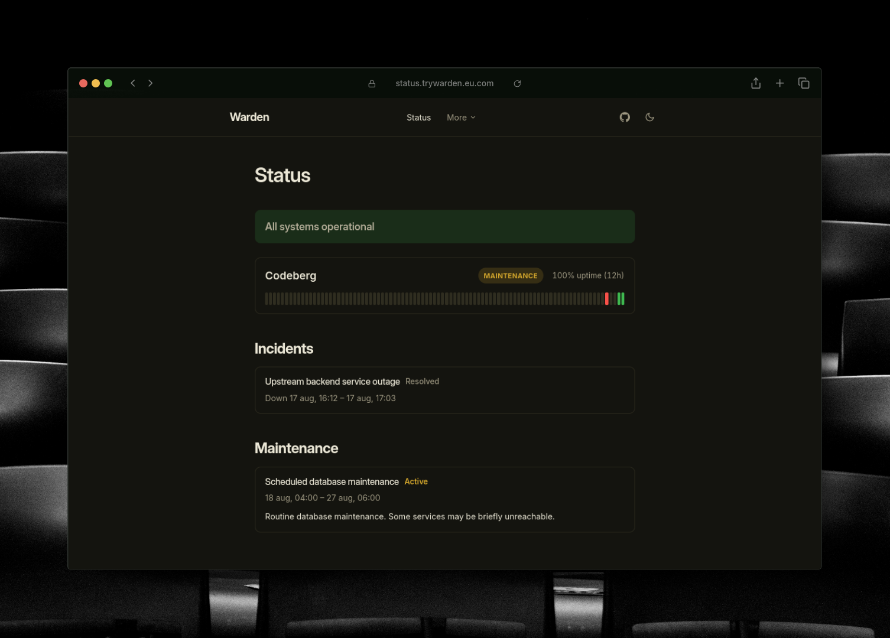

# 🧿 Warden

[](LICENSE)
[](https://github.com/melosso/warden/commits/main)
[](https://github.com/melosso/warden/pkgs/container/warden)

Warden is a self-contained status page. It checks your configured sites on a timer, keeps the history in its own local SQLite database, and reports uptime, downtime, and outages from it, no external backend to run or register with.

It's a child project of [Teatime](https://github.com/melosso/teatime), and reuses that project's Markdown engine, theming, and page-structure system unchanged. Everything around the status page itself (Markdown content, themes, single-language locale files) works the same way it does there.

<div>
      <p align="center"><strong>🔍 <a href="https://melosso.github.io/warden/">See it in action!</a></strong></p>
</div>



## How it works

Your content lives in a `content/` folder:

```
content/
  incidents/    incident and maintenance reports, linked to your monitors
  pages/        standalone pages like About, served at /about
  config.json   optional site settings
  locale/en.json    locale overrides (single language)
```

The status page itself is the site's root ("/") and isn't authored as Markdown. Warden checks your configured targets on a timer and renders it live from what it's collected, using the same theme and layout as the rest of the site. Everything else (`/about`, `/guide`, any page you add under `content/pages/`) is a plain Markdown file with front matter:

```markdown
---
title: About
description: What this status page covers.
---

Outages are reported here as they happen.
```

Once a page is saved, it appears right away. Warden watches your files and rebuilds in memory, so there is nothing to recompile.

## Installation

The quickest way to run Warden is the published container image, which has everything bundled and ready.

### Docker

```bash
mkdir -p warden/content/incidents warden/content/pages warden/content/locale warden/data
cd warden
curl -O https://raw.githubusercontent.com/melosso/warden/main/docker-compose.yml
curl -o content/config.json https://raw.githubusercontent.com/melosso/warden/main/content/config.example.json

docker compose up -d
```

Your own `content/` folder (`.md` pages and `config.json`) mounts from the host, and so does `data/`, where the SQLite heartbeat history lives; without that volume, history resets on every container recreate. `docker-compose.yml`'s `PublicBaseUrl` is the origin you serve from; `AllowedHosts` should match it. What to check lives in `content/config.json`, see [Configuring your site](#configuring-your-site).

Your status page is then waiting at `http://localhost:8080`.

Running locally only? The `PublicBaseUrl`/`AllowedHosts` lines can be left out entirely. Without them, absolute URLs in your sitemap fall back to whatever `Host` header the request carried, which is perfectly fine on localhost.

> **Note:** On a public host that fallback is worth avoiding, since the `Host` header is supplied by the caller. Setting `PublicBaseUrl` and `AllowedHosts` keeps those URLs pinned to your own origin.

### Windows and IIS

If you would rather host on Windows, each release ships a ready to run build:

1. Download the latest `*-Windows_x64.zip` from the [Releases](https://github.com/melosso/warden/releases) page.
2. Extract it into your site folder, for example `C:\inetpub\warden`.
3. Create an IIS site pointed at that folder, with the CLR version set to "No Managed Code".
4. Make sure the [.NET 11 Hosting Bundle](https://dotnet.microsoft.com/download/dotnet/11.0) is installed.
5. Start the site and browse to it.

The zip already includes a `web.config` wired for in process hosting, so no manual edits are needed. A `*-Linux_x64.zip` build is attached to each release as well.

## Incidents and pages

- A live status page at the root: per-monitor up/down badges, a 90-day history bar, 24h uptime, and incidents/maintenance from `content/incidents/`, each reported as a Markdown file with its own page
- Standalone pages under `content/pages/` (About, Guide, a status policy) for anything that isn't a monitor or an incident, each rendered with the site's theme
- `/sitemap.xml` and `/robots.txt` covering your authored pages and the status page
- A JSON status endpoint at `/api/status` for your own tooling
- Light and dark themes

Both incidents and standalone pages go through the same Markdig pipeline, so diagrams, math, and footnotes work in either. The [Markdown examples page](content/pages/examples/markdown.md) shows the syntax for each side by side with its output; the [Markdown Guide](https://www.markdownguide.org/) covers the syntax itself if you need a refresher.

## Configuring your site

`content/config.json` is entirely optional. It sets your site title, description, social links, and what to monitor:

```json
{
  "title": "Warden",
  "description": "Uptime, downtime and outage reporting for Example Corp.",
  "socialLinks": [
    { "icon": "github", "url": "https://github.com/you" }
  ],
  "monitoring": {
    "intervalSeconds": 60,
    "retentionDays": 90,
    "targets": [
      { "id": "forgejo", "name": "Forgejo", "url": "https://forgejo.org" }
    ]
  }
}
```

The `id` in `monitoring` is a custom slug that acts as the database row key. Renaming it resets that target's history, but front matter can reference this ID directly for incident reports. This block hot-reloads with `config.json`: adding, removing, or rescheduling targets takes effect on the next check cycle without a restart. An unreachable target renders as down on the status page instead of throwing an error.

Every field, for every monitor type, is in the [config.json reference](content/pages/examples/config.md).

Only where the SQLite file lives is a deployment concern: set the path in `appsettings.json`, or as an environment variable (`Monitoring__DatabasePath` or the shorter `DatabasePath`):

```json
{
  "Monitoring": {
    "DatabasePath": "data/warden.db"
  }
}
```

Both your pages and your config are hot reloaded, so they can be adjusted while the server keeps running. 

Change languages by updating the `lang` setting in `config.json` (e.g., `"lang": "en"`). This points frontend translations to `content/locale/en.json`, letting you override default text key-by-key without altering any source code.

Keeping `content/` in sync with a Git remote — including private-repo auth — is covered in the [Git sync reference](content/pages/examples/git.md).

Either way, `content/` stays your own checkout on the host — Warden only ever runs `git pull` in it.

## License

Please see [LICENSE](LICENSE) for the full terms.
